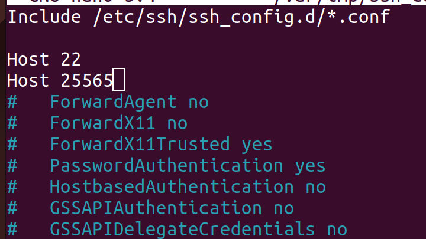

# Daemonit
Käyttöympäristönä Ubuntu 22.10 Kinetic ja laitteena ThinkPad W540 jossa myös dualboot Windows 10 eri levyllä.
Käyttöjärjestelmä on ns. clean install, eli poistin edellisen Ubuntun ja alustin koko ssd:n.
Asennettuna SSH jo valmiina orjille.

## Setup
Muokataan ssh:n configurointi tiedostosta portit auki ja määrätään mitä tiedostoa käytetään:

> sudoedit /etc/ssh/ssh_config

Portti 25565 on epävirallinen Minecraft (Java Edition) multiplayer server portti. Käytin wikipediasta löytyvää [listaa](https://en.wikipedia.org/wiki/List_of_TCP_and_UDP_port_numbers#Well-known_ports).

192.168.56.100
