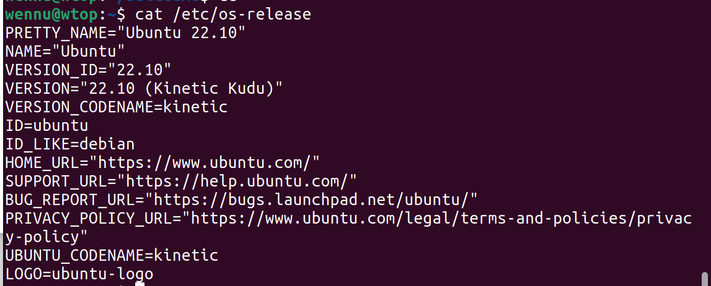

# Daemonit harjoitus
Käyttöympäristönä Ubuntu 22.10 Kinetic ja laitteena ThinkPad W540 jossa myös dualboot Windows 10 eri levyllä.
Käyttöjärjestelmä on ns. clean install, eli poistin edellisen Ubuntun ja alustin koko ssd:n ennen asennusta.

Versiot ja päivitykset ladattu 7.4.2023.

## Daemonit, lyhyesti

## SSH
