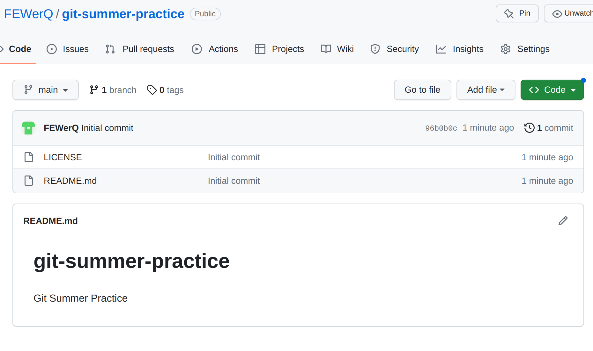

# Git versionhallinta

Tein uuden repositoryn nimeltä "git-summer-practice". Sen sisälle loin automaattisen README tiedoston sekä määritin GNU lisenssin.

## SSH avaimen luonti

Ohjeena käytin:
> https://docs.github.com/en/authentication/connecting-to-github-with-ssh/generating-a-new-ssh-key-and-adding-it-to-the-ssh-agent?platform=linux

Loin uuden avaimen githubia varten.
> ssh-keygen -t ed25519 -C "wjamesimaki@gmail.com"

## SSH avaimen lisäys

Ohjeena käytin:
> https://docs.github.com/en/authentication/connecting-to-github-with-ssh/adding-a-new-ssh-key-to-your-github-account

Tulostin avaimen:
> cat ~/.ssh/id_ed25519.pub

Sitten copy pastesin sen githubiin SSH avaimena nimellä "git-practice-summer"

## Github repon lataus ja muokkaus

Latasin repon terminaalista:
> git clone git@github.comFEWerQ/git-summer-practice.git

Vietin aikaa tutustuen Githubin omaan CLI:hin. Totesin että nyt minun ei tätä tarvitse osata.

### Muutos

Git ei antanut muokata ilman tunnistautumista jollain tasolla, joten jouduin antamaan nimen ja sähköpostin. Entiteetille nimi ns.

> git config --global user.email "wjamesimaki@gmail.com"
> git config --global user.name "Wennu M"
> git add. && git commit; git pull && git push

Tämän jälkeen muutokset saatiin näkyviin githubissa.

### Virhe

Loin tiedoston nimeltä virhe ja sitten palasin aiemman commitin antamaan versioon, täten poistaen tiedoston.

## Logi

Avasin login ja näin sieltä GitHub käyttäjäni luoman repon, sekä myöhemmän commitin uudelta käyttäjältäni. Näistä näkee mihin branchiin muutoksen menevät ja milloin.

