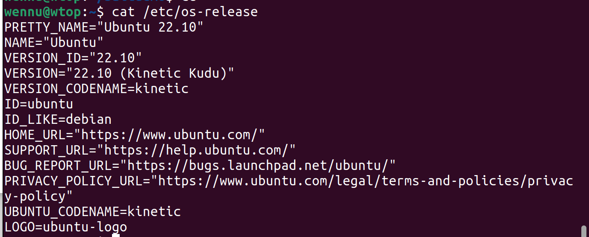

# Steam asennus herra orja arkkitehtuurilla useille tietokoneille

Voit ladata zip tiedoston täältä: [download.zip](https://github.com/FEWerQ/palvelinhallinta/blob/d76ed99c9c085f2766644a3aa4d46860361fe3ea/download.zip).

## Alkutilanne:
Vagrant ympäristö herralla ja neljällä orjalla. Kaikkien käyttöjärjestelmänä toimii debian bullseye/64. Host koneella ubuntu.
Herralla on micro asennettuna tekstinkäsittelyyn.

### Käynnistetään vagrant ja kirjaudutaan herralle:
> Vagrant up
> 
> vagrant ssh gamemaster

### luodaan tiedostoille directory ja siirrytään sinne:
> cd /srv
> 
> sudo mkdir salt
> 
> cd salt

### ladataan deb tiedosto steam asennusta varten:
> sudo wget ”https://repo.steampowered.com/steam/archive/stable/steam_latest.deb”

### luodaan sls tiedosto samaan juureen jolla myöhemmin asennamme kaiken orjille:
> micro installSteam.sls

## SLS tiedoston sisältö:

### varmistetaan tiedostoille käyttöoikeudet
> sudo chmod ugo+x steam_latest.deb
> 
> sudo chmod ugo+x installSteam.sls

### Ajetaan SLS tiedosto testinä ensin yhdelle orjakoneelle:
> sudo salt 'lanPC02' state.apply installSteam

## Virhe

### Komennolla steam kokeilin onko asennus onnistunut.
> sudo salt 'lanPC02' cmd.run 'steam'

Virhe johtuu ilmeisesti siitä että X11 ei onnistu käyttämään näyttöä, yritin korjata tilanteen asentamalla manuaalisesti käyttäen ohjeita Debian Wikistä (https://wiki.debian.org/Xorg)
> sudo salt 'lanPC02' cmd.run 'sudo apt install -y xorg'
> 
> sudo salt 'lanPC02' cmd.run 'sudo apt update && sudo apt upgrade -y'
> 
> sudo salt 'lanPC02' cmd.run 'reboot'

### Virhe toistui, ja en saanut tilannetta korjattua.
Epäilen virheen johtuvan virtualisoinnin tuomista ongelmista.
