# Salt & Vagrant testaus
Käyttöympäristönä Ubuntu 22.10 Kinetic ja laitteena ThinkPad W540 jossa myös dualboot Windows 10 eri levyllä.
Käyttöjärjestelmä on ns. clean install, eli poistin edellisen Ubuntun ja alustin koko ssd:n.
Versiot ja päivitykset ladattu 7.4.2023.

Tehtävän rakennetta voi seurata: https://terokarvinen.com/2023/salt-vagrant/
## Ohjelmistojen asennus

Asensin koneelle terminaalista micro, virtualbox, vagrant, ssh ja apache2.
> sudo apt-get install virtualbox vagrant micro  
> sudo apt-get install ssh  
> sudo apt-get install apache2

Roottiin oma kansio projektille (saltdemo), johon lisätään Vagrantfile jolla käsitellään palvelinympäristö ja sen määrittelyt. Käytän microa tiedoston käsittelyyn.
Vagrantfile lyhyesti: https://friendsofvagrant.github.io/v1/docs/vagrantfile.html
> mkdir saltdemo; cd saltdemo
> micro Vagrantfile

## Palvelinympäristön luonti
Vagrantfileen määriteltiin kolme tietokonetta: Master ja sille kaksi minionia, t001 ja t002.
Yllämainittu oli valmiina tehtävänannossa, mutta pieni muokkaus täytyi tehdä ip-osoitteisiin.

Käynnistää prosessin ja luo koneet.
> vagrant up

Kirjaudutaan masteriin ja hyväksytään minionit.
> vagrant ssh tmaster
> sudo salt-key -A

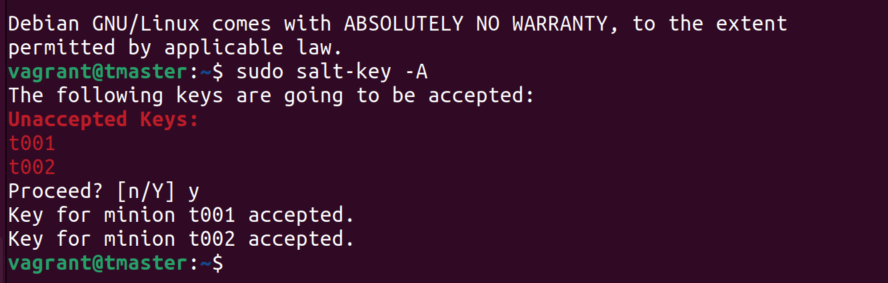

## Testaus
Varmistetaan yhteys ping-testillä sekä lähettämällä komento.
> sudo salt '*' test.ping
> sudo salt '*' cmd.run 'hostname -I'

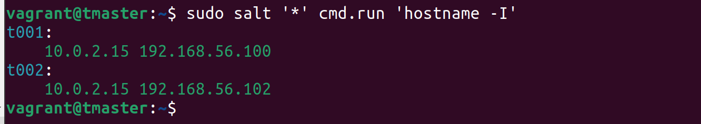

Saltin grains komennoilla voidaan tarkistaa kaikki oleellinen listaamalla mitä halutaan tietää komennon parametreiksi.
Aiheesta:  https://docs.saltproject.io/salt/user-guide/en/latest/topics/grains.html

> sudo salt '*' grains.item osfinger ipv4

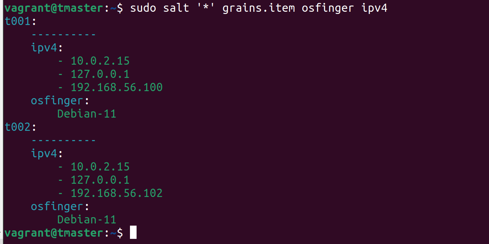

### Masterin toimintojen testaus
Testataan tiedostojen luominen yksinkertaisella "kysymyksellä".
> sudo salt '*' state.single file.managed '/tmp/see-you-at-terokarvinen-com'

Seuraavaksi sama komento mutta määritettiin tuloste "terse", eli niukkasanainen/ytimekäs.
> sudo salt --state-output=terse '*' state.single file.managed '/tmp/see-you-at-terokarvinen-com'

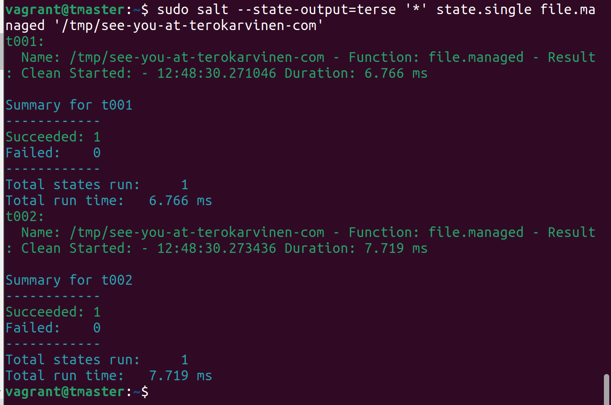

Sama idea mutta asennetaan apache molemmille minioneille, ja laitetaan se päälle.
> sudo salt '*' state.single pkg.installed apache2
> sudo salt '*' state.single service.running apache2

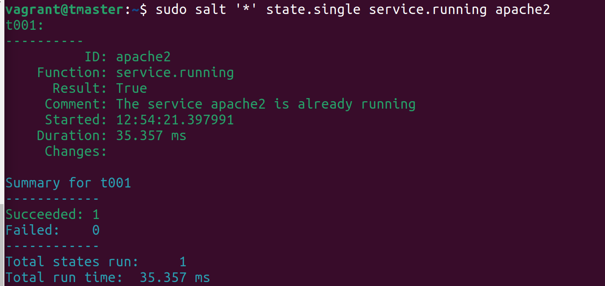

Kokeillaan valehteliko apache meille, eli testataan onko se oikeasti päällä:
> sudo apt-get -y install curl
> curl -s 192.168.56.102|grep title

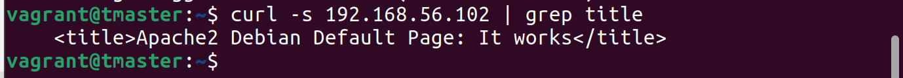

Hienoa, sitten tapetaan apache ja testataan ettei se varmasti ole päällä.
> sudo salt '*' state.single service.dead apache2
> curl 192.168.56.102

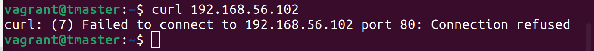

### Käyttäjien manipulointi

Luodaan käyttäjä *terote01* ja muokataan sitä.
> sudo salt '*' state.single user.present terote01
> sudo salt '*' state.single user.present terote01 shell="/bin/bash"

Ei ollut hyvä käyttäjä, yritetään poistaa.
> sudo salt '*' state.single user.absent terote01

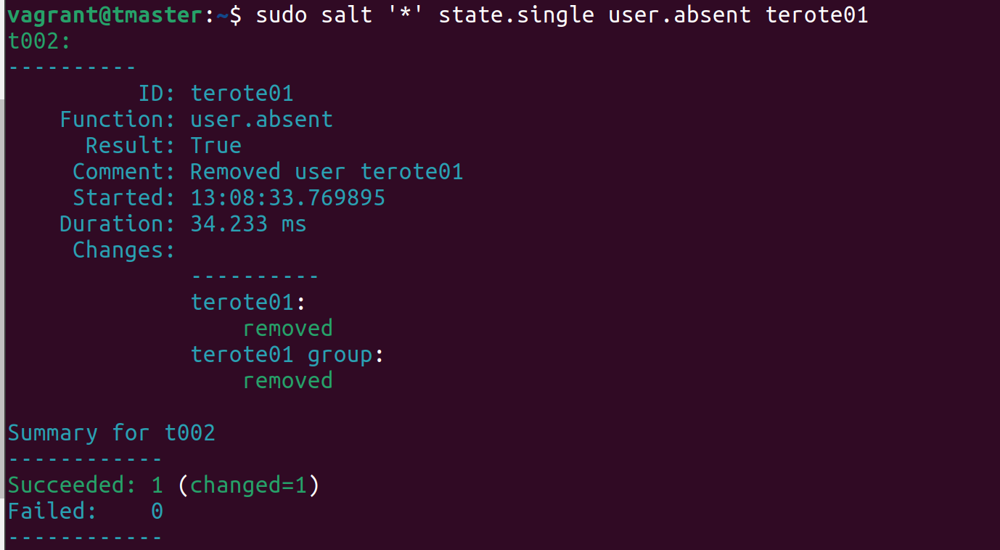

## Infraa koodina

> sudo mkdir -p /srv/salt/hello
> sudoedit /srv/salt/hello/init.sls

Init.sls sisälle:
> /tmp/infra-as-code:  
> &nbsp;&nbsp;file.managed

Ajetaan yllä luotu hello.
> sudo salt '*' state.apply hello

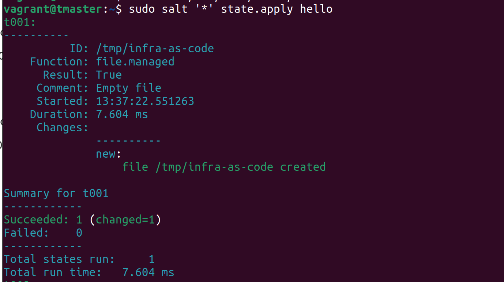

### top.sls
https://docs.saltproject.io/en/latest/ref/states/top.html

Luodaan top-tiedosto ja testataan se.
> sudoedit /srv/salt/top.sls

Tiedostoon sisälletään yksinkertaine: "suorittakaa kaikki: hello" -ohje.

> base:
> 
> &nbsp;&nbsp;'*':
> 
> &nbsp;&nbsp;&nbsp;&nbsp;- hello

> cat /srv/salt/top.sls

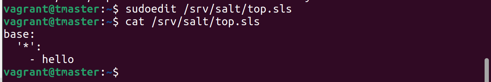

> sudo salt '*' state.apply

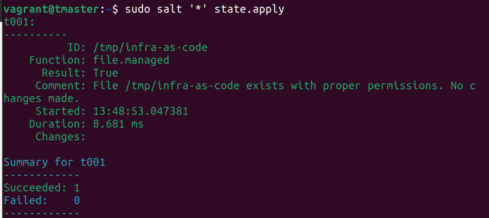
